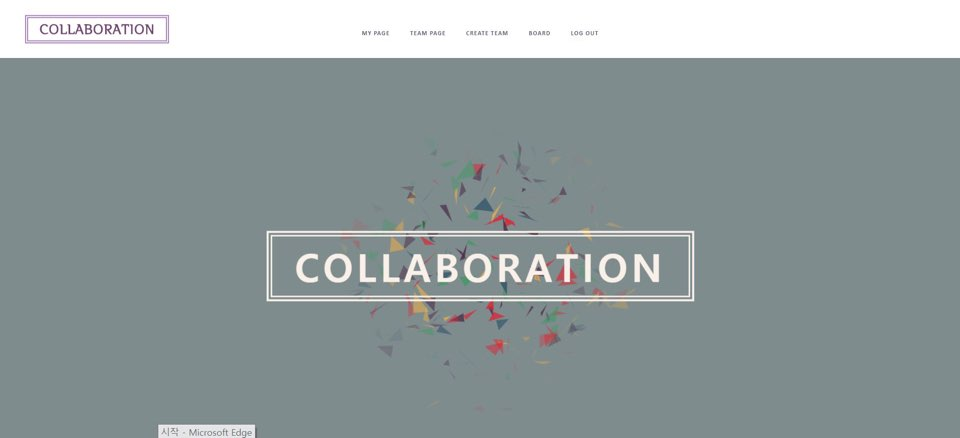
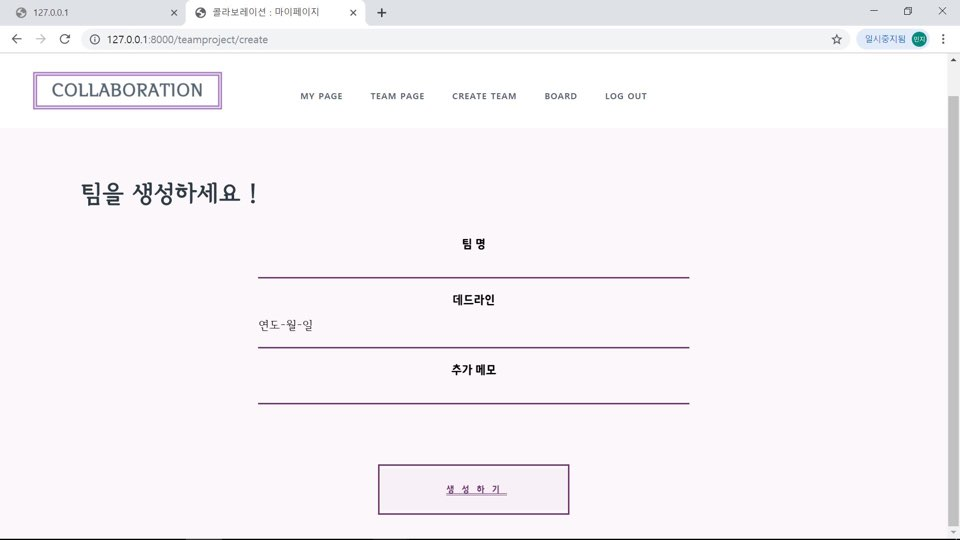
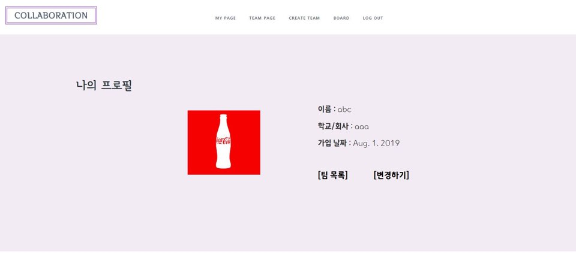
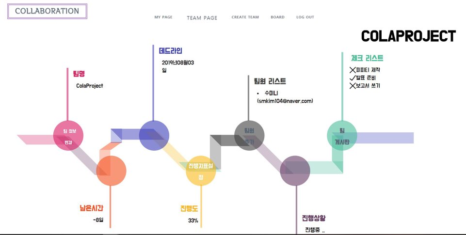
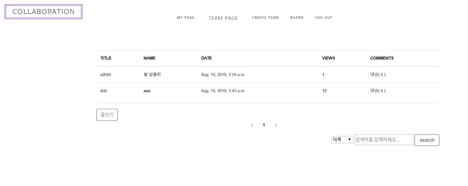

# 팀플협업플랫폼: Collaboration 

### TEAM
 **한민지, 김효성, 김수민, 김민지, 이동규**

### Introduction
팀플을 한 곳에서 관리할 수 있는 플랫폼

### Screenshot
메인화면:

팀생성:

프로필:

진행 지표 설정:

진행상황:

게시판:

### TECH
 - framework : Django 	
 - front end
		- javascript
		- html
		- jquery
		- css
- back end
		- python
- 배포 : pythonanywhere
		
### Set up
install VSCode
install Django

>  before you must install pip, python

    pip install django

make virtualenv

    python -m venv '가상환경이름'

and then do git pull

 
사이트 : [콜라보레이션](http://hyoriezmann.pythonanywhere.com/)
 
QR code:

